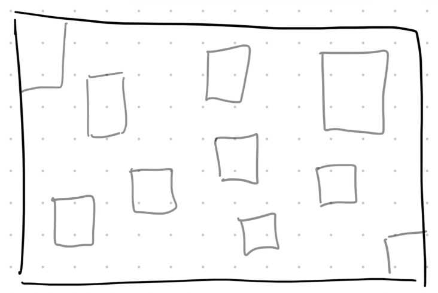

# Design System — Larissa Sans
### Visual Identity Proposal

> This document defines the visual language for larissasans.com.
> It is derived from Larissa's existing marks, artworks, and her own direction: simple but sophisticated · black and white · roasted pink in details · non-serif type.

---

## Brand Essence

The visual identity should feel like a well-curated artist's studio:
white walls, a single painting on an easel, deliberate silence.
Nothing decorative that doesn't earn its place.
The art does the talking — the system frames it, then gets out of the way.

**Three words**: Intimate. Intentional. Uncompromising.

---

## 1. Logo System

Larissa has three existing marks. Together they form a complete logo family.

### Primary mark — The Stamp

The hand-drawn "LS" monogram inside an irregular square border.
Used as the primary logo in the header, favicon, and all formal touchpoints.

*Use: header, favicon, email signature, watermarks, packaging.*

---

### Secondary mark — The Face

A minimal line illustration of a woman's face — bold, clean black strokes on white.
Larissa's artistic alter-ego. Used as a hero accent or section divider.

*Use: About page, editorial layouts, print materials.*

---

### Accent mark — The Star

A hand-drawn 8-pointed star. Functions as a bullet point, section divider, or decorative pause.
Replaces conventional design punctuation across all touchpoints.

*Use: list items, section separators, loading states, social captions.*

---

### Logo usage rules

- All marks are used **black on white** or **white on black** only — never on a coloured background except as a watermark at very low opacity
- Never resize the stamp below 24px in digital or 8mm in print
- Minimum clear space around the stamp: equal to the width of the inner border on all sides
- The three marks are **never stacked or grouped together** — each appears alone

---

## 2. Colour Palette

The palette is built from what is already present in Larissa's work: the studio walls, the raw canvas, the roasted pinks of her small-format paintings, and the dense ink of her linoprints.

---

### Primary colours

| Name | Swatch | Hex | Usage |
|---|---|---|---|
| Studio Black | ■ | `#111010` | Type, marks, primary backgrounds, borders |
| Canvas White | ■ | `#F5F3F0` | Page background, cards, breathing space |

---

### Accent colour

| Name | Swatch | Hex | Usage |
|---|---|---|---|
| Roasted Pink | ■ | `#C4826E` | CTAs, hover states, active links, selected states, small accent details |

The roasted pink is used sparingly — a detail, not a background. It appears the way it does in her work: as a single element of warmth inside a mostly neutral composition.

Reference: the mini canvas series below, where roasted pink is paired against dusty lavender and off-white.

---

### Supporting tones (use sparingly)

| Name | Hex | Usage |
|---|---|---|
| Parchment | `#EDE9E3` | Subtle section separators, hover backgrounds |
| Roasted Pink Tint | `#F2E5E0` | Very light tint for section backgrounds when warmth is needed |
| Deep Ink | `#0A0A0A` | High-contrast text on white — the blackest black |

---

### What the palette is not

- No bold colours competing with the art
- No gradients
- No drop shadows
- No pure `#000000` or pure `#FFFFFF` — use Studio Black and Canvas White instead

---

## 3. Typography

### Direction
Non-serif throughout. Clean and modern with enough personality to feel human — not cold.
The type should feel like a caption next to a painting in a gallery: precise, quiet, readable.

---

### Type scale

| Role | Typeface | Weight | Size (desktop) | Size (mobile) |
|---|---|---|---|---|
| Display / Hero | **Spectral** | ExtraBold (800) | 72–96px | 40–52px |
| Heading H2 | **Spectral** | Bold (700) | 40–52px | 28–36px |
| Heading H3 | **Spectral** | Regular (400) | 24–32px | 20–24px |
| Body | **DM Sans** | Regular (400) | 16–18px | 15–16px |
| Body emphasis | **DM Sans** | Medium (500) | 16–18px | 15–16px |
| Caption / Label | **DM Sans** | Regular (400) | 12–13px | 12px |
| Navigation | **DM Sans** | Medium (500) | 13–14px | 13px |

Both fonts are available free on Google Fonts.
- [Spectral on Google Fonts](https://fonts.google.com/specimen/Spectral)
- [DM Sans on Google Fonts](https://fonts.google.com/specimen/DM+Sans)

---

### Type rules

- **Letter-spacing**: Display text uses `letter-spacing: 0.02em`; navigation and labels use `letter-spacing: 0.08–0.12em` (all caps sparingly)
- **Line height**: Body text at `1.6`; headings at `1.1–1.2`
- **Max line length**: 65–70 characters for body text
- **Alignment**: left-aligned in almost all contexts; centred only for short standalone statements (the artist statement, section titles on the homepage)
- **Bilingual text**: English and Portuguese set in the same weight and size — no hierarchy between the two languages

---

### Type + colour combinations

| Text | Background | Colour |
|---|---|---|
| Body / headings | Canvas White | Studio Black |
| Body / headings | Studio Black | Canvas White |
| CTA label | Roasted Pink | Canvas White |
| Caption | Canvas White | Studio Black at 50% opacity |

---

## 4. Graphic Elements & Marks

Beyond the three logo marks, the following elements form the visual grammar of the brand.

### The hand-drawn line
All decorative borders, section frames, and underlines reference the organic, imperfect quality of Larissa's hand. No perfect geometric lines. Borders are slightly uneven — as if drawn by a fine-tipped pen.

The "LS" stamp border is the reference for this quality.

### The star as punctuation
The star mark (Star 2) appears as:
- A bullet point replacement in lists
- A separator between two blocks of copy
- A decorative element next to dates, locations, or credits

It is always rendered in **Studio Black** or **Canvas White** — never in Roasted Pink.

### Linoprint texture as background reference
The linoprint work (see below) introduces a textural register that can be referenced in background treatments: very subtle paper-grain textures on full-bleed sections, or as a texture overlay on photography at low opacity.

This image is also a strong candidate for the hero section of the Portfolio page.

---

## 5. Photography Style

Larissa's photography falls into two registers. Both are appropriate for the website.

### Register 1 — Studio / Process (Behind the scenes)

Intimate, slightly warm-toned. Larissa at work. The art mid-creation.
These images convey authenticity and invite the viewer into the studio.

---

### Register 2 — Art documentation

Clean, minimal. Works photographed against neutral walls or white surfaces.
The work is the subject.

---

### Photography rules

- Never crop art tightly — always leave breathing space around the work
- Process photos may be slightly underexposed and warm — this is intentional
- No filters, no saturation boosts
- Art documentation: clean, neutral background, no props
- No stock photography — every image on the site should be Larissa's own work or of Larissa herself

---

## 6. Layout Principles

### The grid
- 12-column grid on desktop, 4-column on mobile
- Generous margins: `80–120px` horizontal on desktop, `24px` on mobile
- Vertical rhythm based on `8px` base unit

### The gallery (portfolio)
Inspired by wireframe_1: an asymmetric arrangement of cards, slightly rotated at random angles (±1–3°), like works laid out on a studio floor or pinned to a board.

Each card shows the work at full bleed. No titles overlaid on the image — the title appears below the card in a small caption label.

### Spacing philosophy
White space is not empty — it is the wall of the studio.
Sections should breathe. Resist the temptation to fill.

| Token | Value |
|---|---|
| `space-xs` | 8px |
| `space-sm` | 16px |
| `space-md` | 32px |
| `space-lg` | 64px |
| `space-xl` | 120px |
| `space-2xl` | 200px |

### Section rhythm
Alternate between:
1. Full-bleed image or art (no margins)
2. Text section with generous horizontal margins
3. Grid of works

This creates a breathing, editorial pace — not a scrolling list of content blocks.

---

## 7. UI Components

### Buttons & CTAs

| State | Background | Text | Border |
|---|---|---|---|
| Default (primary) | Studio Black | Canvas White | — |
| Hover (primary) | Roasted Pink | Canvas White | — |
| Default (secondary / ghost) | Transparent | Studio Black | 1px Studio Black |
| Hover (secondary) | Transparent | Roasted Pink | 1px Roasted Pink |

- Button text: DM Sans Medium, `letter-spacing: 0.08em`, all lowercase
- Border radius: `0` — no rounded corners (sharp, clean)
- Padding: `14px 32px`

### Navigation

- Horizontal, top-fixed
- Left: LS stamp logo
- Right: text links — `About · Portfolio · Services · Contact`
- Mobile: hamburger → full-screen overlay in Studio Black with links in Spectral ExtraBold at large scale
- Active link: underlined with a 1px Roasted Pink line

### Cards (services, portfolio)

- No drop shadows
- Border: 1px Studio Black (optional — can be borderless on Canvas White background)
- Image always above text
- Caption below: project name (DM Sans Medium) + category (DM Sans Regular, 50% opacity)
- Hover: image scales `1.02` with `transition: 0.4s ease`

### Form / Contact

- Input fields: bottom border only (1px Studio Black) — no full border box
- Focus state: bottom border becomes Roasted Pink
- Submit button: primary button style
- The Google Form should eventually be replaced with a native form for consistency

---

## 8. Motion & Interaction

Motion is subtle and intentional — like turning a page, not performing.

| Interaction | Behaviour |
|---|---|
| Page load | Fade in, 400ms, `ease-out` |
| Image hover | Scale `1.02`, 400ms |
| Link hover | Colour transition, 200ms |
| Navigation open (mobile) | Slide down, 300ms |
| Gallery card tilt | Static rotation applied at load — not animated |
| CTA hover | Background colour transition, 200ms |

No parallax. No scroll-triggered animations on text. No looping video backgrounds.

---

## 9. Brand Voice — Visual Summary

| Dimension | Direction |
|---|---|
| Colour | Black + white, roasted pink in details only |
| Type | Non-serif, clean, low contrast between weights |
| Marks | Hand-drawn, slightly imperfect, always black |
| Photography | Intimate, warm, honest — never polished or editorial in a commercial sense |
| Layout | Generous white space, asymmetric gallery, the art always the largest element |
| Motion | Minimal, slow, quiet |
| Mood | A studio visit, not a shop window |

---

## 10. Asset Index

All source assets available in this project:

| File | Type | Role |
|---|---|---|
| `brand lari/Assinatura.png` | Logo | Primary mark — LS stamp |
| `arts lari/Logo 2.png` | Illustration | Secondary mark — female face |
| `arts lari/Star 2.png` | Mark | Accent — 8-pointed star |
| `arts lari/IMG_7433.JPG` | Photography | Studio portrait — hero candidate |
| `arts lari/IMG_7449.JPG` | Photography | Studio process — atmospheric |
| `arts lari/IMG_7457.JPG` | Photography | Studio process — detail |
| `arts lari/DSCF3546.JPG` | Photography | Studio — figurative work in progress |
| `arts lari/DSCF3651.JPG` | Photography | Larissa with painting — portrait |
| `arts lari/IMG_7636.jpg` | Photography | Works displayed — wall installation |
| `arts lari/IMG_1854.jpg` | Art | Colour reference — roasted pink palette |
| `arts lari/IMG_4987.jpg` | Art | Painting — textured eye |
| `arts lari/IMG_4991.jpg` | Art | Painting — figurative, warm ochre |
| `arts lari/IMG_7451.JPG` | Art | Linoprint — hero candidate for Portfolio |
| `reference_docs/wireframe_1.png` | Reference | Gallery layout sketch |

---

*Last updated: April 2026*
*Next step: Apply this system in the website build — see `personal_brand.md` for copy and content strategy.*
